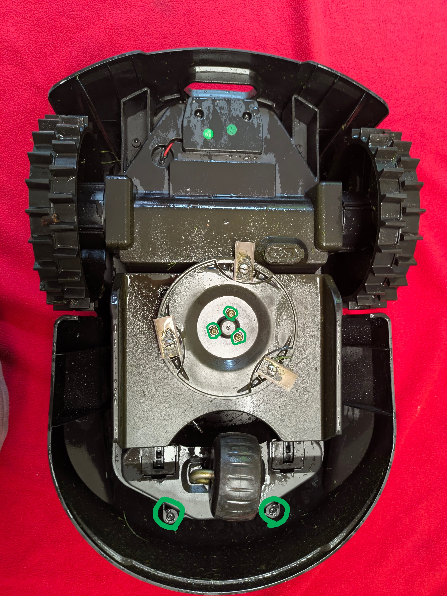
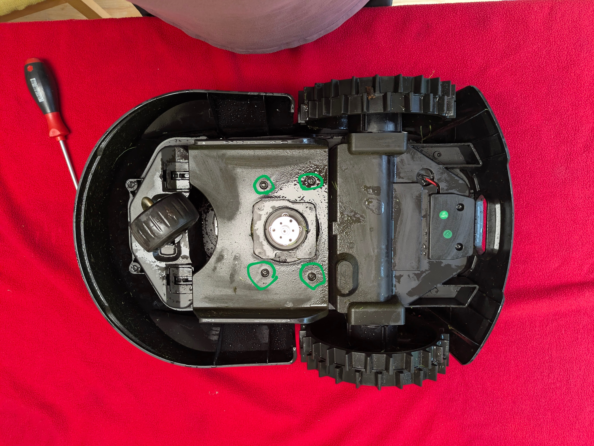
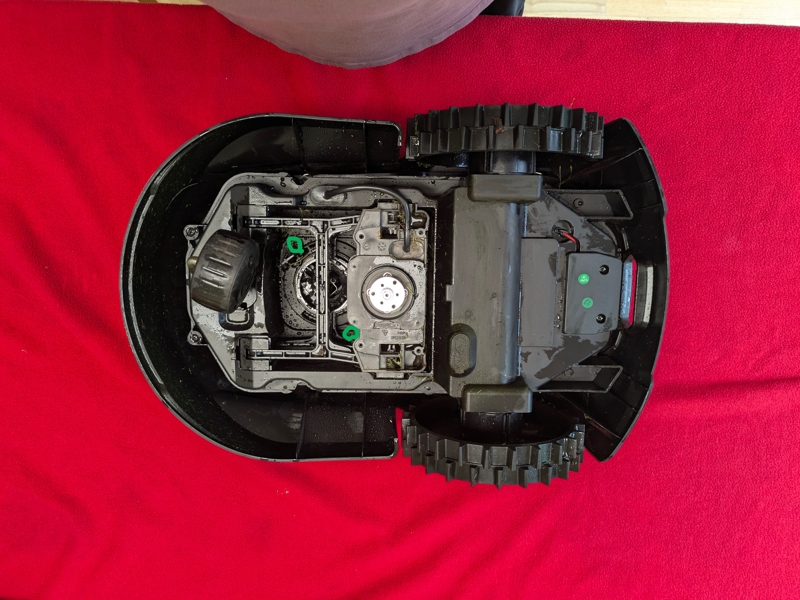
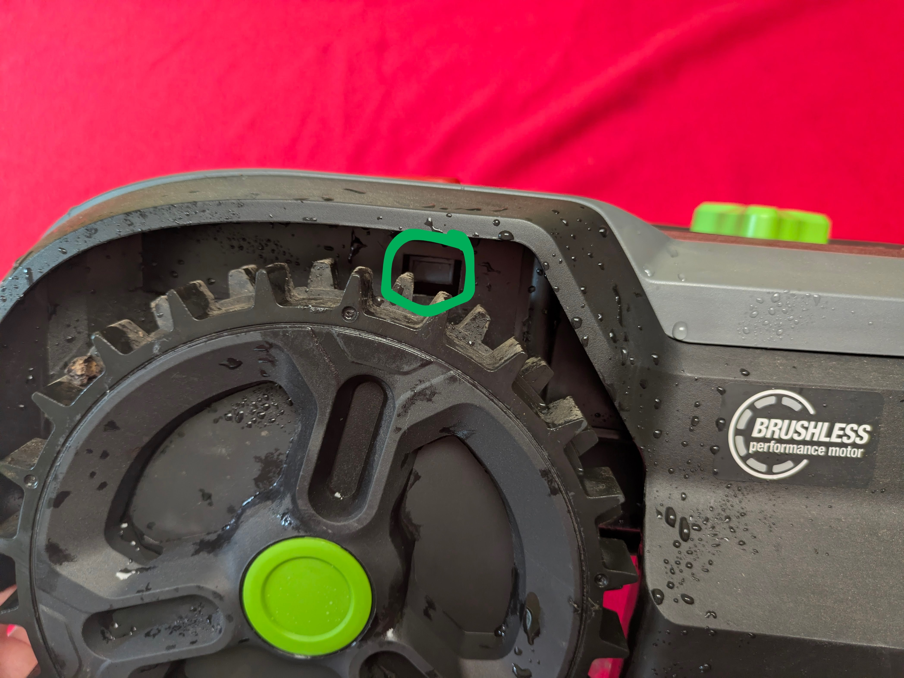
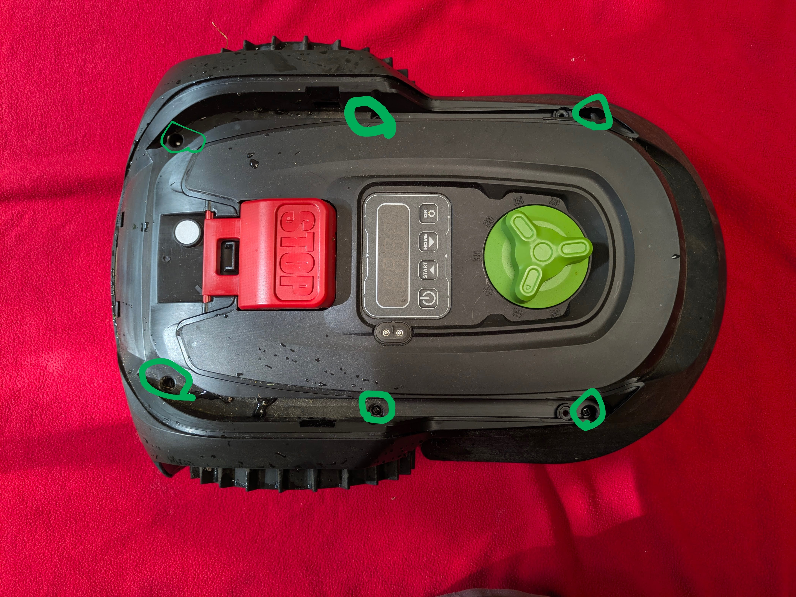

# Disassembly Guide — SNK Mower

Opening the mower to access the mainboard (SWD pads, USB port, EEPROM).

---

### Step 1 — Bottom screws

Remove all screws marked in green. These hold the bottom plate and give access
to the wheel/motor assembly area.

---

### Step 2 — Wheel covers & screws

Remove the wheel covers and the screws underneath.

---

### Step 3 — Rear screws

Additional screws at the rear of the chassis.

---

### Step 4 — Side latches

Press the latches on both sides to release the upper shell.

---

### Step 5 — Top shell screws

Once the latches are released, remove the remaining screws securing the top shell.

---

### Step 6 — Electronics access

Lift off the top cover. The mainboard (SNK_MAINBOARD_CP_V11) and display board
(SNK_DISPLAY_CP_V11) are now visible.

