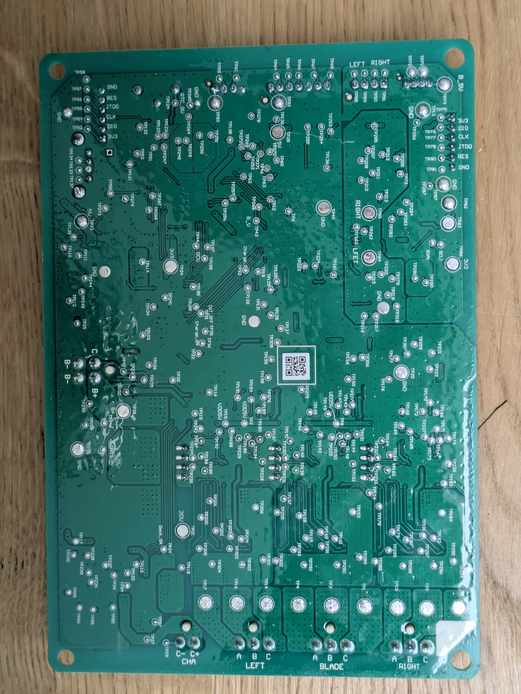
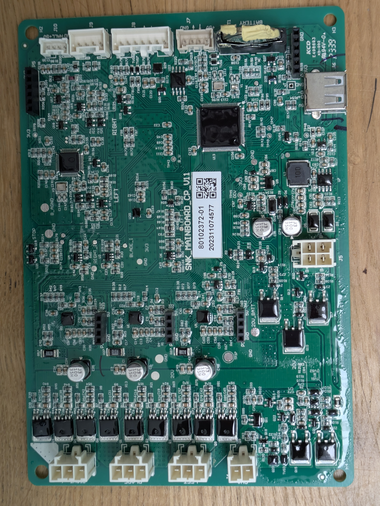
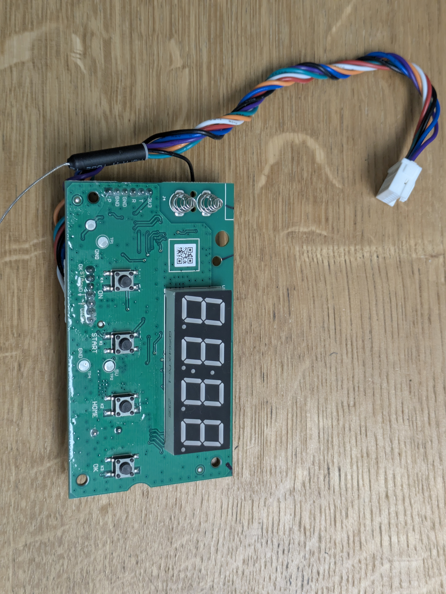

# Hardware Documentation — SNK Mower (Lux Tools A-RMR-300-24)

## Overview

The mower contains two PCBs connected via a ribbon cable/header:
1. **Mainboard** (`SNK_MAINBOARD_CP_V11`) — motor control, sensors, navigation logic
2. **Display Board** (`SNK_DISPLAY_CP_V11`) — UI, buttons, display, ESP32

Both are manufactured on the **SNK** platform, shared with **Adano RM5** (Harald Nyborg, Schou).

---

## Mainboard: `SNK_MAINBOARD_CP_V11`

 

### Identifiers
| Label | Value |
|-------|-------|
| Board model | `SNK_MAINBOARD_CP_V11` |
| Part number | `80102372-01` |
| Date code | `202311074577` |
| Certifications | `KCD E498693 KD-002`, `94V-0` |

### Microcontrollers

| Ref | Chip | Architecture | Role |
|-----|------|-------------|------|
| **U13** | `GD32F305 AGT6` (GigaDevice) | ARM Cortex-M4 | Main MCU — motors, BLDC control, navigation, boundary wire sensing, EEPROM access |
| **U16** | `GD32F303 CGT6` (GigaDevice) | ARM Cortex-M4 | Secondary MCU — UART bridge to display board, forwards button presses to U13 |

### Memory

| Ref | Package | Likely Type | Role |
|-----|---------|-------------|------|
| **U22** | SOIC-8 (left of U13) | I²C EEPROM (24C02/04) | **Stores PIN code**, schedule, working hours, ENV/KV config — entire PCB covered in protective coating, difficult to probe directly |
| **U12** | SOIC-8 (right of U13, below crystal) | SPI Flash (25xx) or 2nd EEPROM | Firmware update staging or additional logging |

### Power

| Ref | Function |
|-----|----------|
| **U7** | Buck converter — 20V battery → 3.3V/5V logic rails |
| **J5** (`BATTERY`) | Main 20V Li-Ion battery input (2-pin white connector) |

### BLDC Motor Drivers

Three 3-phase brushless motors, controlled by MOSFET banks (bottom edge with heatsinks):

| Connector | Phases | Function |
|-----------|--------|----------|
| `LEFT` | `A B C` | Left drive wheel |
| `RIGHT` | `A B C` | Right drive wheel |
| `BLADE` | `A B C` | Cutting disc |
| `CHA` | `C- C+` | Charging contacts from docking station |

### Inter-Board Connector: J8 (Display Board ↔ Mainboard)

**J8** is the main 7-pin connector linking the display board to the mainboard via a ribbon cable. Pinout (as labeled on mainboard silkscreen):

| Pin | Label | Function | Direction |
|-----|-------|----------|-----------|
| 1 | `+5V` | Power to display board | Mainboard → Display |
| 2 | `ON` | Power button (K4) | Display → Mainboard (direct GPIO) |
| 3 | `→` | **UART TX from mainboard → RX to ESP32** | Mainboard → Display |
| 4 | `←` | **UART TX from ESP32 → RX to mainboard** | Display → Mainboard |
| 5 | `GND` | Ground | |
| 6 | `Start` | Start button (K1) | Display → Mainboard (direct GPIO) |
| 7 | `OK` | OK button (K3) | Display → Mainboard (direct GPIO) |

**Key architectural insight:** The three buttons (ON, Start, OK) are **forked** — they connect to both:
1. **Mainboard directly** (via ribbon cable pins 2, 6, 7) — so mainboard responds instantly to button presses without coordination
2. **ESP32 locally** on the display board — so ESP32 can monitor/relay button events and control display

The **bidirectional UART** on pins 3-4 is the only digital communication channel between the two boards.

### Sensors & I/O Connectors

| Connector | Label | Function |
|-----------|-------|----------|
| `J10` / `H2` | `HALL +5V GND` | Hall effect sensor on front bumper — lift/tilt or collision detection |
| `J9` | — | Boundary wire loop coils (EM sensing, 2 coils under chassis) |
| `J7` | — | 4-pin UART diagnostic port (TX/RX/GND) — **unpopulated in this unit** |
| `U19` | `STOP` | Physical emergency stop button connector |

### USB Port
- **Type**: USB-A female (host), covered by rubber grommet on mower exterior
- **Function**: USB flash drive for log export and firmware update files
- **IC** (U3 area): USB host controller / power switch

### SWD Debug Ports

Both MCUs have accessible SWD ports. Pins are labeled on the **back** of the board.

#### P4 → U13 (GD32F305, Main MCU)

Through-hole pads on right edge, near USB port.

| Pin (top→bottom) | Label | TP Ref |
|:---:|:---:|:---:|
| 1 | `3V3` | TP74 |
| 2 | `DIO` (SWDIO) | TP76 |
| 3 | `CLK` (SWCLK) | TP77 |
| 4 | `JTDO` | TP78 |
| 5 | `RES` | TP80 |
| 6 | `GND` | TP81 |

#### P5 → U16 (GD32F303, Secondary MCU)

Black female header (pin socket), left side of board.

| Pin (top→bottom) | Label | TP Ref |
|:---:|:---:|:---:|
| 1 | `GND` | TP58 |
| 2 | `RES` | TP57 |
| 3 | `JTDO` | TP55 |
| 4 | `CLK` (SWCLK) | TP56 |
| 5 | `DIO` (SWDIO) | TP64 |
| 6 | `3V3` | — |

---

## Display Board: `SNK_DISPLAY_CP_V11`

 

### Identifiers
| Label | Value |
|-------|-------|
| Board model | `SNK_DISPLAY_CP_V11` |
| Part number | `80102373-01` |
| Date code | `20231020` |
| Laminate date | `2339` (week 39, 2023) |

### Wireless Module (Hidden Feature)

**U5**: `ESP32-WROOM-32UE` (Espressif)

Despite the mower being marketed as "simple, no wireless connectivity", the display board has a fully functional ESP32 with:
- Dual-core Tensilica Xtensa LX6
- Wi-Fi 802.11 b/g/n
- Bluetooth v4.2 BR/EDR + BLE
- External antenna via IPEX/U.FL connector (wire monopole, glued with white silicone)

Certifications:
- `FCC ID: 2AC7Z-ESPWROOM32UE`
- `CMIT ID: 2020DP10074(M)`
- `IC: 21098-ESPWROOMUE`

### Display & Buttons

| Component | Marking | Description |
|-----------|---------|-------------|
| Display | `GD5643CPG-1` (code `2335`) | 4-digit 7-segment LED, green/red, colon separator |
| K4 | `ON` | Power button (top) |
| K1 | `START` | Start mowing (2nd) |
| K2 | `HOME` | Return to dock (3rd) |
| K3 | `OK` | Confirm/select (bottom) |

### Driver ICs

| Ref | Package | Verified Type | Role |
|-----|---------|---------------|------|
| **U1, U3, U4** | SOP-16 | `74HC595` | Cascaded 3-stage shift registers for driving 4-digit 7-segment display (24 output bits total: segment select, digit select, and colon) |
| **U2** | — | Local 3.3V buck converter | Local 3.3V rail from ribbon cable +5V input (includes coil `3R3`) |
| **BU1** | — | Piezo buzzer | Driven via PWM and transistor driver |

### ESP32 GPIO Mapping

The ESP32 module (U5) is mapped to the display, buttons, sensors, and mainboard UART as follows:

| Pin / Function | ESP32 GPIO | ESP32 Pad | Circuit Path & Details |
|----------------|:----------:|:---------:|------------------------|
| **UART RX** (from MB) | **13** | Pad 16 | ESP32 Pad 16 → `R32` → `FB2` → J8 Pin 3 (`→`) |
| **UART TX** (to MB) | **15** | Pad 23 | ESP32 Pad 23 → `R35` → `FB3` → J8 Pin 4 (`←`) |
| **Display CS/Latch** | **5** | Pad 29 | VSPI CS: ESP32 Pad 29 → ST_CP (Pin 12) of U1/U3/U4 |
| **Display SCLK** | **18** | Pad 30 | VSPI SCLK: ESP32 Pad 30 → SH_CP (Pin 11) of U1/U3/U4 |
| **Display MOSI** | **23** | Pad 37 | VSPI MOSI: ESP32 Pad 37 → DS (Pin 14) of U1 |
| **Button K4** (`ON`) | **27** | Pad 12 | Top-edge GPIO: Pad 12 → `R10` → J8 Pin 2 (`ON`) / K4 |
| **Button K1** (`START`) | **26** | Pad 11 | Top-edge GPIO: Pad 11 → `R6` → J8 Pin 6 (`Start`) / K1 |
| **Button K2** (`HOME`) | **25** | Pad 10 | Top-edge GPIO: Pad 10 → `R12` → local K2 switch |
| **Button K3** (`OK`) | **33** | Pad 9 | Top-edge GPIO: Pad 9 → `R7` → J8 Pin 7 (`OK`) / K3 |
| **Buzzer BU1** | **12** | Pad 14 | Buzzer PWM: ESP32 Pad 14 → `R29` → transistor driver → BU1 |
| **Rain Sensor J4** | **36** | Pad 4 | ADC Input (SENSOR_VP): J4 contact → input filtering → ESP32 Pad 4 |

### Connectors

| Connector | Pins | Function |
|-----------|------|----------|
| **J1** | 6-pin female header | ESP32 **programming** UART (UART0): `3U3 T R GND GND P` (P = IO0/Prog) — used with FT232R + esptool.py to dump 4 MB flash at 921600 baud. **Not connected to mainboard.** |
| **J4** | 2 spring contacts | Rain/moisture detector (short when wet) |
| **Main header** | 7-pin white | Inter-board connector — mates with mainboard **J8**: `+5V ON → ← GND Start OK` |

---

## SWD Debug Connections (RPi Pico)

Flash [debugprobe](https://github.com/raspberrypi/debugprobe) UF2 on RPi Pico.

### Pico Pinout for debugprobe

| GPIO | Function |
|:---:|:---:|
| GP2 | **SWCLK** |
| GP3 | **SWDIO** |

### Wiring to Mainboard

#### P4 → U13 (Main MCU, GD32F305)

| Pico Pin | Pico GPIO | SWD | P4 Pin |
|:---:|:---:|:---:|:---:|
| Pin 3 | GND | GND | 6 (bottom) — GND (TP81) |
| Pin 4 | GP2 | SWCLK | 3 — CLK (TP77) |
| Pin 5 | GP3 | SWDIO | 2 — DIO (TP76) |

#### P5 → U16 (Secondary MCU, GD32F303)

| Pico Pin | Pico GPIO | SWD | P5 Pin |
|:---:|:---:|:---:|:---:|
| Pin 3 | GND | GND | 1 (top) — GND |
| Pin 4 | GP2 | SWCLK | 4 — CLK |
| Pin 5 | GP3 | SWDIO | 5 — DIO |

> Do NOT connect Pico 3.3V. The mower powers itself from its battery.

### udev Rule

```bash
echo 'SUBSYSTEM=="usb", ATTRS{idVendor}=="2e8a", ATTRS{idProduct}=="000c", MODE="0666"' | \
  sudo tee /etc/udev/rules.d/99-pico-debugprobe.rules
sudo udevadm control --reload-rules && sudo udevadm trigger
```

---

