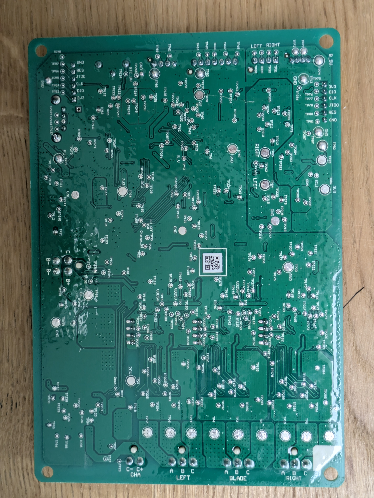
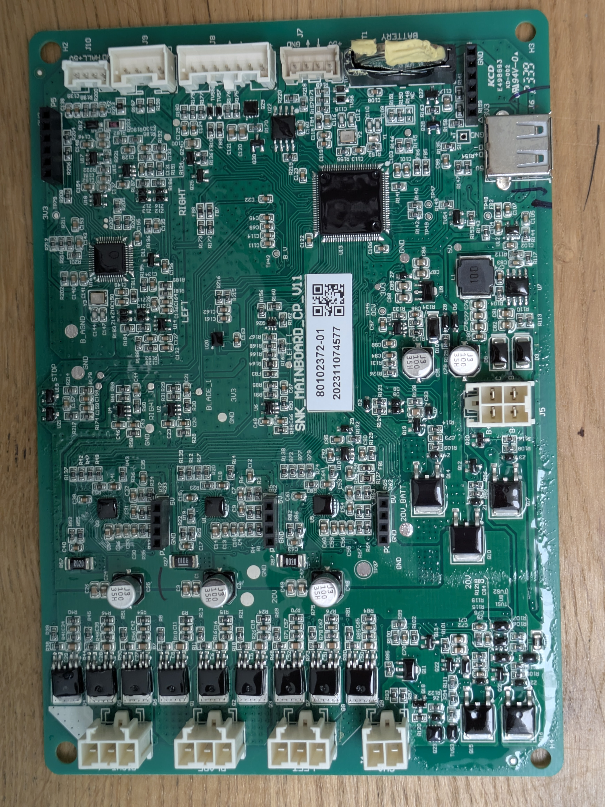

# Hardware Documentation — SNK Mower (Lux Tools A-RMR-300-24)

> **Korekta 2026-10-09** (dowody: [`20261009_claude_investigation.md`](20261009_claude_investigation.md)): ESP32 łączy się UART-em bezpośrednio z U13 (`dpport`, USART0); U16 nie jest mostem, tylko MCU czujników przewodu/podnoszenia na osobnym porcie U13 (`bdport`). Przyciski START/HOME/OK są na ESP32 GPIO22/21/19 (pull-up, aktywne niskim); `0x10000001/2/7` to komendy klawiszy (START+OK = start koszenia, HOME+OK = powrót), nie potwierdzenia błędów.

## Overview

The mower contains two PCBs connected via a ribbon cable/header:
1. **Mainboard** (`SNK_MAINBOARD_CP_V11`) — motor control, sensors, navigation logic
2. **Display Board** (`SNK_DISPLAY_CP_V11`) — UI, buttons, display, ESP32

Both are manufactured on the **SNK** platform, shared with **Adano RM5** (Harald Nyborg, Schou).

---

## Mainboard: `SNK_MAINBOARD_CP_V11`

 

### Identifiers
| Label | Value |
|-------|-------|
| Board model | `SNK_MAINBOARD_CP_V11` |
| Part number | `80102372-01` |
| Date code | `202311074577` |
| Certifications | `KCD E498693 KD-002`, `94V-0` |

### Microcontrollers

| Ref | Chip | Architecture | Role |
|-----|------|-------------|------|
| **U13** | `GD32F305 AGT6` (GigaDevice) | ARM Cortex-M4 | Main MCU — motors, BLDC control, navigation, PIN/settings (env on SPI NOR), USB bootloader |
| **U16** | `GD32F303 CGT6` (GigaDevice) | ARM Cortex-M4 | Secondary MCU: boundary-wire coils, lift/hall sensors. JSON link to U13 (`mport` USART2 ↔ U13 `bdport`). Not connected to the display board |

### Memory

| Ref | Package | Likely Type | Role |
|-----|---------|-------------|------|
| — | 8-pin | SPI NOR, Winbond W25Q64JVSIQ (8 MB) | EasyFlash env/KV store of U13: **PIN (`pwd`)**, user settings, schedule, product config (`cfgstr`, `pdt_ver`, feature flags), event log, firmware staging for USB/UART updates. Erased whole by `FORMATFLASH.json` |
| **U22** | 8-pin, below U13 next to J7 | Not identified | Not the PIN store: the firmware keeps `pwd` in the SPI NOR env. The I²C device at `0x68` that was read earlier is the IMU (below), not U22 |

### IMU

U13 talks to a **TDK ICM-426xx** 6-axis IMU (accelerometer + gyroscope) on I²C at 7-bit address **`0x68`** (control byte `0xD0`), pins PB10 = SCL, PB11 = SDA (peripheral `0x40005800`, GD32 I2C1). Firmware: driver `tdk42688_lib\IcmAlgo.c`, WHO_AM_I check at `0x0807ce6a` accepting `0x47` (ICM-42688-P) or `0x6F`, message "Check ICM whoami value ERROR". It feeds tilt, slope and lift-by-attitude detection. A Bosch BNO055 driver (`driver_mems_snk_v13.c`) is also compiled in, for boards with that part at `0x28`. Which package on the PCB is the IMU has not been located on the photos (ICM-42688 is LGA-14, 2.5 × 3 mm).

### Power

| Ref | Function |
|-----|----------|
| **U7** | Buck converter — 20V battery → 3.3V/5V logic rails |
| **J5** (`BATTERY`) | Main 20V Li-Ion battery input (4-pin white connector: V+, GND and the pack data line). The pack's BMS talks to U13 USART2 (PD8/PD9, 19200 8N1, half-duplex), see [BATTERY.md](BATTERY.md#communication-protocol) |

U13 holds its own power on (from the U13 bootloader `0x08000f38` and the shutdown at `0x0807e72c`):

| U13 pin | Role |
|---------|------|
| **PE12** | Main power latch. Raised first thing by the bootloader; power-off holds it low until the rail collapses |
| PE7 | Auxiliary rail, raised by the bootloader, dropped first on power-off |
| PB0 | Secondary latch, raised by the bootloader on a power-on reset |
| PE10, PE11 | Key inputs, active low (bootloader "key press power on", app button driver) |
| PE8 | Charger present, active high |

### BLDC Motor Drivers

Three 3-phase brushless motors, controlled by MOSFET banks (bottom edge with heatsinks). Each motor has its own **Fortior FU6832N** BLDC controller (8051 + FOC with its own firmware, 5-pin header `5V GND` + 3 signals next to it). The U13 firmware calls them A4963 (`a4963_snk_v2.c`): the FU6832N firmware emulates the Allegro A4963 SPI register interface. Identification of the FU6832N is from the photos of the MI 302 board in [salonnikov/mower-stock-reverse](https://github.com/salonnikov/mower-stock-reverse); not yet checked on our board.

| Signal | U13 pin |
|--------|---------|
| SPI1 SCK / MISO / MOSI | PB13 / PB14 / PB15 |
| Common driver enable | PB12 (SPI1 NSS used as GPIO) |
| Chip select left / right / blade | PD5 / PD4 / PD3 (active low) |
| Speed PWM left / right / blade | TIMER2 full remap: PC9 (CH3) / PC8 (CH2) / PC7 (CH1) |
| Wheel speed feedback | TIMER3 input capture |

SPI word: bits 15–13 register address, bit 12 write, bits 11–0 data. The init writes eight registers per driver, e.g. `03E8 22DF 4753 6721 8735 A736 C000 EE0D` (`EE0D` = RUN).

| Connector | Phases | Function |
|-----------|--------|----------|
| `LEFT` | `A B C` | Left drive wheel |
| `RIGHT` | `A B C` | Right drive wheel |
| `BLADE` | `A B C` | Cutting disc |
| `CHA` | `C- C+` | Charging contacts from docking station |

### Inter-Board Connector: J8 (Display Board ↔ Mainboard)

**J8** is the main 7-pin connector linking the display board to the mainboard via a ribbon cable. Pinout (as labeled on mainboard silkscreen):

| Pin | Label | Function | Direction |
|-----|-------|----------|-----------|
| 1 | `+5V` | Power to display board | Mainboard → Display |
| 2 | `ON` | Power button (K4) | Display → Mainboard (direct GPIO) |
| 3 | `→` | **UART TX from mainboard → RX to ESP32** | Mainboard → Display |
| 4 | `←` | **UART TX from ESP32 → RX to mainboard** | Display → Mainboard |
| 5 | `GND` | Ground | |
| 6 | `Start` | Start button (K1) | Display → Mainboard (direct GPIO) |
| 7 | `OK` | OK button (K3) | Display → Mainboard (direct GPIO) |

**Key architectural insight:** Only the OK button is shared between ESP32 (GPIO19) and mainboard (J8 pin 7).
ON (J8 pin 2) and START (J8 pin 6) connect to the mainboard but have **no confirmed** connection to the ESP32.

The **bidirectional UART** on pins 3-4 is the only digital communication channel between the two boards.

### Sensors & I/O Connectors

| Connector | Label | Function |
|-----------|-------|----------|
| `J10` / `H2` | `HALL +5V GND` | Hall effect sensor on front bumper — lift/tilt or collision detection |
| `J9` | — | Boundary wire loop coils (EM sensing, 2 coils under chassis) |
| `J7` | `+5V ↑ ↓ GND` | 4-pin header, populated but **not connected to anything** in the assembled mower. Serial port (+5V, TX, RX, GND): same arrow notation as the UART pins of J8, TVS TUS5/TUS6 and series resistors R169/R171 on the two signal lines. Probably the port for the optional LED/ultrasonic board (`ledport`, UART3, enabled by `lboard_en`); inferred, not traced to U13 pins. Not USB — see below |
| `U19` | `STOP` | Physical emergency stop button connector |

### USB Port
- **Type**: USB-A female (host), covered by rubber grommet on mower exterior
- **Function**: USB flash drive for log export and firmware update files
- **Parts next to J6** (photo): FB5/FB6 ferrites on D+/D-, TUS4 TVS, U12 (SOT-23-5, likely VBUS switch). Wired to U13 USBFS (PA11/PA12), used only by the U13 bootloader at power-on: pendrive (host) or PC custom-HID (device). See [`20261010_usb_investigation.md`](20261010_usb_investigation.md)
- **Only USB on the board.** The GD32F305 has a single USBFS peripheral (PA11/PA12) and it goes to J6. J7 has no ferrites on its lines and is labelled with direction arrows (USB D+/D- are bidirectional and the board labels them `D- D+` on J6), so J7 is a UART, not a second USB port. The bootloader's PC (device) mode also runs on J6, presumably with an A-to-A cable at the factory

### SWD Debug Ports

Both MCUs have accessible SWD ports. Pins are labeled on the **back** of the board.

#### P4 → U13 (GD32F305, Main MCU)

Through-hole pads on right edge, near USB port.

| Pin (top→bottom) | Label | TP Ref |
|:---:|:---:|:---:|
| 1 | `3V3` | TP74 |
| 2 | `DIO` (SWDIO) | TP76 |
| 3 | `CLK` (SWCLK) | TP77 |
| 4 | `JTDO` | TP78 |
| 5 | `RES` | TP80 |
| 6 | `GND` | TP81 |

#### P5 → U16 (GD32F303, Secondary MCU)

Black female header (pin socket), left side of board.

| Pin (top→bottom) | Label | TP Ref |
|:---:|:---:|:---:|
| 1 | `GND` | TP58 |
| 2 | `RES` | TP57 |
| 3 | `JTDO` | TP55 |
| 4 | `CLK` (SWCLK) | TP56 |
| 5 | `DIO` (SWDIO) | TP64 |
| 6 | `3V3` | — |

---

## Display Board: `SNK_DISPLAY_CP_V11`

 

### Identifiers
| Label | Value |
|-------|-------|
| Board model | `SNK_DISPLAY_CP_V11` |
| Part number | `80102373-01` |
| Date code | `20231020` |
| Laminate date | `2339` (week 39, 2023) |

### Wireless Module (Hidden Feature)

**U5**: `ESP32-WROOM-32UE` (Espressif)

Despite the mower being marketed as "simple, no wireless connectivity", the display board has a fully functional ESP32 with:
- Dual-core Tensilica Xtensa LX6
- Wi-Fi 802.11 b/g/n
- Bluetooth v4.2 BR/EDR + BLE
- External antenna via IPEX/U.FL connector (wire monopole, glued with white silicone)

Certifications:
- `FCC ID: 2AC7Z-ESPWROOM32UE`
- `CMIT ID: 2020DP10074(M)`
- `IC: 21098-ESPWROOMUE`

### Display & Buttons

| Component | Marking | Description |
|-----------|---------|-------------|
| Display | `GD5643CPG-1` (code `2335`) | 4-digit 7-segment LED, green/red, colon separator |
| K4 | `ON` | Power button (top) |
| K1 | `START` | Start mowing (2nd) |
| K2 | `HOME` | Return to dock (3rd) |
| K3 | `OK` | Confirm/select (bottom) |

### Driver ICs

| Ref | Package | Verified Type | Role |
|-----|---------|---------------|------|
| **U1, U3, U4** | SOP-16 | `74HC595` | Cascaded 3-stage shift registers for driving 4-digit 7-segment display (24 output bits total: segment select, digit select, and colon) |
| **U2** | — | Local 3.3V buck converter | Local 3.3V rail from ribbon cable +5V input (includes coil `3R3`) |
| **BU1** | — | Piezo buzzer | Driven via PWM and transistor driver |

### ESP32 GPIO Mapping

The ESP32 module (U5) is mapped to the display, buttons, sensors, and mainboard UART as follows:

| Pin / Function | ESP32 GPIO | ESP32 Pad | Circuit Path & Details |
|----------------|:----------:|:---------:|------------------------|
| **UART RX** (from MB) | **16** | Pad 27 | ESP32 Pad 27 → `FB3` → `R35` → `TP16` → `TVS5` → J8 Pin → MB TX |
| **UART TX** (to MB) | **17** | Pad 28 | ESP32 Pad 28 → `FB2` → `R32` → `TP15` → `TVS2` → J8 Pin → MB RX |
| **Display CS/Latch** | **32** | Pad 8 | ESP32 Pad 8 (GPIO32) → `R31` → pod `U3` → `TP27` → Pin 12 (`ST_CP`) rejestrów `U1/U3/U4` |
| **Display SCLK** | **33** | Pad 9 | ESP32 Pad 9 (GPIO33) → `R33` → pod `U3/U4` → Pin 11 (`SH_CP`) rejestrów `U1/U3/U4` |
| **Display MOSI** | **25** | Pad 10 | ESP32 Pad 10 (GPIO25) → `R34` → `TP29` → przelotka → Pin 14 (`DS`) rejestru `U1` |
| Display, unknown | **26** | — | Not traced. The original firmware sets it high in `TubeInit`, then low after the first blank frame, and never touches it again |
| Unknown | **2** | — | Not traced. The original firmware drives it high for 15 s after boot and after each OK press ("tube LP timer") |
| **Button K3** (`OK`) | **19** | Pad 31 | Potwierdzone testem — GPIO19 zmienia stan przy naciśnięciu OK |
| **Buzzer BU1** | **27** | Pad 12 | Buzzer PWM: ESP32 Pad 12 (GPIO27) → `R29` → transistor driver → BU1 |
| **Button K1** (`START`) | **22** | Pad 36 | Input, internal pull-up, active low (firmware `0x400daf7c`) |
| **Button K2** (`HOME`) | **21** | Pad 33 | Input, internal pull-up, active low |
| **Rain sensor, measure** | **36** | Pad 4 | ADC1_CH0 (SENSOR_VP), 11 dB attenuation |
| **Rain sensor, drive** | **18**, **5** | — | Outputs driving the two electrodes in alternating polarity (18 high / 5 low while measuring, reversed in between) |

ON (K4) is not wired to the ESP32; it goes only to J8. See "Final Determination" below.

The rain sensor is resistive. Every 2 s the firmware drives GPIO18 high and GPIO5 low for 1 s, takes 5 ADC samples on GPIO36, then reverses the polarity for 1 s so the electrodes do not corrode. A running average above 3000 (of 4095) is dry, at or below is wet; 16 samples in a row on one side change the state. The ESP32 reports it to U13 as `0x22000000 {"rain":1}` (dry) or `{"rain":2}` (raining). Details: [`20261010_mower-stock-reverse-results.md`](20261010_mower-stock-reverse-results.md#czujnik-deszczu).

### Tracing wizualny ścieżek wyświetlacza (Zweryfikowany na PCB):

Dzięki fizycznej analizie ścieżek na płycie `SNK_DISPLAY_CP_V11` (zdjęcia `PXL_20260616_120305142 (2).jpg` i `PXL_20260620_182450200.jpg`, w repo jako [`img/display_front2.jpg`](img/display_front2.jpg)) potwierdzono dokładne połączenia:
1. **SCLK (Clock) - GPIO33 (Pad 9)**: Biegnie do `R33`, pod układ `U3`, do linii `SH_CP` (Pin 11) wszystkich układów `74HC595`.
2. **CS/Latch - GPIO32 (Pad 8)**: Biegnie do `R31`, pod układ `U3`, przez punkt testowy `TP27` bezpośrednio na linię `ST_CP` (Pin 12) wszystkich układów `74HC595`.
3. **MOSI (Data) - GPIO25 (Pad 10)**: Biegnie do `R34`, punktu testowego `TP29` i przez przelotkę na drugą stronę płyty bezpośrednio do linii `DS` (Pin 14) pierwszego układu `U1`.
4. **Master Reset (MR - Pin 10)**: Z kondensatora `C16` (bocznikującego GND/3.3V) doprowadzona jest ścieżka przez rezystor `R3` na Pin 10 (`MR`) układu `U3` (i analogicznie dla reszty). MR jest sprzętowo podciągnięte do 3.3V, co wyłącza reset sprzętowy.
5. **OE (Output Enable - Pin 13)**: Piny 13 układów `U1/U3/U4` są sprzętowo podłączone do masy (GND), dzięki czemu wyjścia są stale aktywne.

Jasności nie da się więc regulować sprzętowo (brak PWM na OE). Oryginalny firmware jej nie zmienia: każda cyfra świeci 2 ms z 8 ms. Tryb nocny w komponencie ESPHome przyciemnia wyświetlacz, gasząc cyfrę przed końcem jej 2 ms.

Wszystkie układy `U1/U3/U4` są zorientowane poziomo:
* Pin 8 (GND) to dolna skrajnie prawa nóżka.
* Pin 16 (VCC) to górna skrajnie lewa nóżka (z kondensatorem filtrującym).

### Connectors

| Connector | Pins | Function |
|-----------|------|----------|
| **J1** | 6-pin female header | ESP32 **programming** UART (UART0): `3U3 T R GND GND P` (P = IO0/Prog) — used with FT232R + esptool.py to dump 4 MB flash at 921600 baud. **Not connected to mainboard.** |
| **J3, J4** | spring contacts | Rain sensor electrodes; they press against the contact plate in the housing. Water lowers the resistance between them |
| **Main header** | 7-pin white | Inter-board connector — mates with mainboard **J8**: `+5V ON → ← GND Start OK` |

---

## Experiments: Button GPIO Detection

We conducted a series of firmware tests to determine which physical buttons (K1–K4) are connected to the ESP32 and which pins they use.

### Test 1: GPIO Scan (pin_diag)

**Method:** Custom `pin_diag` mode in snk_mower component. Sets all 24 accessible GPIOs as inputs, polls every 100ms, logs any level change.

**Pins scanned:** `{0, 2, 4, 5, 12, 13, 14, 15, 16, 17, 18, 19, 21, 22, 23, 25, 26, 27, 32, 33, 34, 35, 36, 39}`

**Result:**
- **GPIO19** — changes state when OK (K3) is pressed ✅
- All other GPIOs — no change when pressing any button (START, HOME, OK, ON)

### Test 2: ADC Scan (resistor ladder hypothesis)

**Hypothesis:** Buttons might be connected through a resistor ladder to a single ADC pin, where each button produces a different voltage level.

**Method:** ESPHome ADC sensors on all ADC1 pins (GPIO32–36, 39) with `raw: true` and `update_interval: 50ms`, using `delta: 30` filter to report only significant changes.

**Pins tested:**
| GPIO | ADC Unit | Result |
|------|----------|--------|
| 32 | ADC1_CH4 | Noisy (~2400–2700 raw), no change with buttons |
| 33 | ADC1_CH5 | Noisy (~1200–1400 raw), no change with buttons |
| 34 | ADC1_CH6 | 0 (pulled to GND), no change with buttons |
| 35 | ADC1_CH7 | ~980–1020 (noise only), no change with buttons |
| 36 | ADC1_CH0 | Rain sensor (short when wet), no change with buttons |
| 39 | ADC1_CH3 | 4095 (pulled to VCC), no change with buttons |

**Conclusion:** No resistor ladder. ADC pins show only noise — no voltage step when any button is pressed.

### Final Determination

| Button | Ref | Connection | How ESP32 detects it |
|--------|-----|------------|---------------------|
| START | K1 | **GPIO22** + J8 `ST` | Direct GPIO read (key code 1) |
| HOME | K2 | **GPIO21** only (not on J8) | Direct GPIO read (key code 2) |
| OK | K3 | **GPIO19** + J8 `OK` | Direct GPIO read (key code 4) |
| ON | K4 | J8 `ON` → mainboard **only** | Not read by ESP32 (power-on) |

Source: ESP32 `ota_0.bin` button driver init `0x400daf7c` (`gpio_set_direction(INPUT)` + `gpio_set_pull_mode(PULLUP_ONLY)` on 22, 21, 19) and poll `0x400daef8` (active low, bit0=22, bit1=21, bit2=19). Pin↔button mapping from long-press menus matching the manual (START 3 s = date, HOME 3 s = RAIN, START+HOME = PIN).

**Key insight (corrected 2026-10-09):** the ESP32 runs the UI. On START or HOME it sends `0x10000007`; OK within 3 s sends `0x10000001` (mow) or `0x10000002` (home). U13 also reads PE10/PE11 (active low, used by the bootloader's "key press power on"), most likely the `ST`/`OK` lines on J8. That is inferred, not traced on the PCB. The earlier GPIO scan missed START/HOME because without `INPUT_PULLUP` the lines float.

---

## SWD Debug Connections (RPi Pico)

Flash [debugprobe](https://github.com/raspberrypi/debugprobe) UF2 on RPi Pico.

### Pico Pinout for debugprobe

| GPIO | Function |
|:---:|:---:|
| GP2 | **SWCLK** |
| GP3 | **SWDIO** |

### Wiring to Mainboard

#### P4 → U13 (Main MCU, GD32F305)

| Pico Pin | Pico GPIO | SWD | P4 Pin |
|:---:|:---:|:---:|:---:|
| Pin 3 | GND | GND | 6 (bottom) — GND (TP81) |
| Pin 4 | GP2 | SWCLK | 3 — CLK (TP77) |
| Pin 5 | GP3 | SWDIO | 2 — DIO (TP76) |

#### P5 → U16 (Secondary MCU, GD32F303)

| Pico Pin | Pico GPIO | SWD | P5 Pin |
|:---:|:---:|:---:|:---:|
| Pin 3 | GND | GND | 1 (top) — GND |
| Pin 4 | GP2 | SWCLK | 4 — CLK |
| Pin 5 | GP3 | SWDIO | 5 — DIO |

> Do NOT connect Pico 3.3V. The mower powers itself from its battery.

### udev Rule

```bash
echo 'SUBSYSTEM=="usb", ATTRS{idVendor}=="2e8a", ATTRS{idProduct}=="000c", MODE="0666"' | \
  sudo tee /etc/udev/rules.d/99-pico-debugprobe.rules
sudo udevadm control --reload-rules && sudo udevadm trigger
```

---

