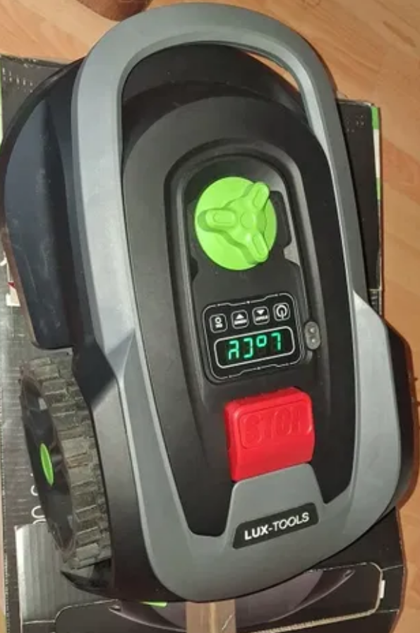

# SNK Mower — Lux Tools A-RMR-300-24 & clones



This project documents the **SNK OEM** robot mower platform — the same hardware
sold under many brands across Europe. It covers everything you need: PIN recovery,
firmware dumps, protocol analysis, and the current status of replacing the
original firmware with ESPHome.

| Brand | Model(s) | Sold at / Region |
|-------|----------|------------------|
| **Lux Tools** | A-RMR-300-24, Oryx 300 Vision A-RMR-300-26 | OBI (PL/DE) |
| **Scheppach** | BRMR300, BTRM300, RRMA300 | Bauhaus, Aldi, Blocket (DE/SE) |
| **Brucke** | RM500, RM501, RM800 | Finland |
| **Adano** | RM5 | Harald Nyborg, Schou (DK/SE) |
| **Gomag** | Go-MR300 | DE |
| **Grouw** | City 300² | Schou (Scandinavia) |
| **Smart** | 365 500m² | Schou (Scandinavia) |
| **Meec Tools** | 300 m² (art. 027415) | Jula (FI/SE) |
| **Julan** | 300 m² | Jula (FI/SE) |
| **Landxcape** | (referenced in firmware) | — |
| **Sunseeker** | V1 300m² Vision AI | Puuilo (FI) |

All share part numbers: mainboard `80102372-01`, display `80102373-01`.
OEM: SNK (also SK-Robot for MQTT cloud).

Interesting fact: despite the manufacturer not advertising or supporting it,
every mower has fully functional WiFi and Bluetooth on the ESP32 — disabled
in the original firmware but unlockable by flashing custom firmware.

---

## Why are you here?

### I want to recover the PIN

Go to **[PIN.md](PIN.md)** — step-by-step SWD guide + alternative methods.

### I want to migrate to ESPHome

Go to **[ha.md](ha.md)** — current status, what works, what doesn't, integration architecture.

### I want to replace the battery

Go to **[BATTERY.md](BATTERY.md)** — compatible packs, replacement guide, DIY upgrade.

---

## Documentation

| File | Contents |
|------|----------|
| [HARDWARE.md](HARDWARE.md) | Boards, MCUs, pinouts, SWD ports, GPIO |
| [PROTOCOLS.md](PROTOCOLS.md) | Inter-chip communication protocols (verified by LA) |
| [captures/README.md](captures/README.md) | 64 decoded UART commands from 6 capture scenarios |
| [BATTERY.md](BATTERY.md) | 5S Li-Ion battery — specs, BMS, replacement guide |

### Per-processor

| Folder | Processor | Role | Contents |
|--------|-----------|------|----------|
| [esp32/](esp32/) | ESP32-WROOM-32UE | Display, WiFi/BT, UI | dumps, notes |
| [u13/](u13/) | GD32F305 (main MCU) | Motors, navigation, PIN, USB | dumps, decomp, notes, datasheet |
| [u16/](u16/) | GD32F303 (board MCU) | Sensors, UART bridge, motors | dump, notes |

---

## System Overview

```
                   Display Board (SNK_DISPLAY_CP_V11)
                   ┌─────────────────────────────────────┐
                   │ ESP32: UI, WiFi/BT, rain, buzzer    │
                   │ 4-digit 7-seg LED + 4 buttons      │
                   └────────┬────────────────────────────┘
                            │ UART @230400 8N1, JSON
                            │ #&{"cmd":...}\n
                   ┌────────▼────────────────────────────┐
                   │ Main Board (SNK_MAINBOARD_CP_V11)    │
                   │                                      │
                   │ U16 (GD32F303) — sensors, motors,    │
                   │   UART bridge, IEC 60730            │
                   │                                      │
                   │ U13 (GD32F305) — motors, navigation, │
                   │   USB host, KV-store, ★ PIN        │
                   │                                      │
                   │ U22 (24C02 EEPROM) — PIN, settings   │
                   └──────────────────────────────────────┘
```

---

## Repository Map

```
kosiarka/
├── README.md           ← this file
├── PIN.md              ← PIN recovery guide
├── ha.md               ← ESPHome — work-in-progress status
├── HARDWARE.md         ← hardware, pinouts, SWD
├── PROTOCOLS.md        ← communication protocols
├── BATTERY.md          ← 5S Li-Ion battery analysis
│
├── esp32/              ← ESP32: dumps, analysis notes
├── u13/                ← GD32F305: dumps, decomp, notes, eeprom
├── u16/                ← GD32F303: dump, notes
│
├── captures/           ← UART logic analyzer captures (6 scenarios)
├── components/         ← ESPHome custom component (snk_mower)
├── img/                ← PCB photographs
├── tools/              ← scripts, OpenOCD configs, stubs
├── doc/                ← original user manual
├── docs/               ← internal documentation
├── ghidra_proj/        ← Ghidra project files
├── sw/                 ← third-party tools (ghidra, JDK, ghidra-cli)
├── class_scripts/      ← Java classes for Ghidra bridge
├── results/            ← mower search results
└── results/            ← mower search results
```

---

## External References

- [Brucke RM500/RM501/RM800 infopaketti (io-tech.fi)](https://bbs.io-tech.fi/threads/brucke-rm500-rm501-rm800-robottiruohonleikkurin-infopaketti.405186/)
  Finnish community thread covering the same SNK/Sunseeker platform.

---

*Documentation produced through reverse engineering for educational purposes.*
