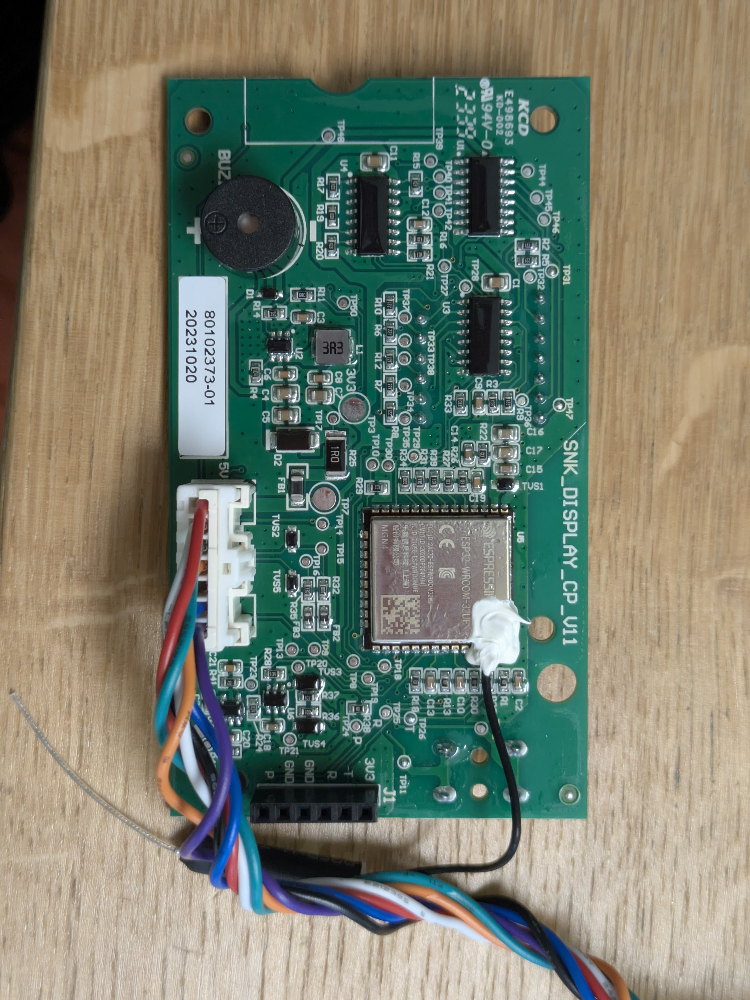

# SNK Mower Hack — Lux Tools A-RMR-300-24

Reverse engineering and PIN bypass for the **Lux Tools A-RMR-300-24 Special Edition** robot lawn mower — a rebranded Chinese OEM platform also sold as **Adano RM5** (Harald Nyborg / Schou).

## Background

Purchased second-hand on OLX (Poland), this mower was locked with an unknown PIN set by the previous owner. Default PINs (`0000`, `1234`, etc.) did not work. This project documents the hardware, firmware extraction via SWD, and recovery strategy.

## Hardware

### Mainboard: `SNK_MAINBOARD_CP_V11`

 

**Labels**: `SNK_MAINBOARD_CP_V11` / `80102372-01` / `202311074577`

| Component | Marking | Role |
|-----------|---------|------|
| **U13** | `GD32F305 AGT6` | Main MCU (Cortex-M4) — motors, sensors, navigation |
| **U16** | `GD32F303 CGT6` | Secondary MCU (Cortex-M4) — display/UI bridge |
| **U22** | SOIC-8 (24Cxx) | I²C EEPROM — **stores the PIN code**, config, schedule |
| **U12** | SOIC-8 | SPI Flash / second EEPROM |
| **U7** | Buck converter | 20V → 5V/3.3V step-down |

**Motor drivers**: Three BLDC channels (3-phase `A B C`):
- `LEFT` — left wheel
- `RIGHT` — right wheel
- `BLADE` — cutting disc
- `CHA` (`C- C+`) — charging contacts

**Connectors**:
| Connector | Label/Function |
|-----------|----------------|
| `J5` | `BATTERY` — main 20V Li-Ion input |
| `J7` | 4-pin white — UART diagnostic port (TX/RX/GND) |
| `J8` | Free sensor connector (auxiliary/bumper) |
| `J9` | Boundary wire loop coils (EM sensing) |
| `J10` / `H2` | `HALL +5V GND` — Hall effect (lift/tilt/bumper) |
| `U19` | `STOP` — physical emergency stop button |

**SWD Debug Ports**:
- **P5** → U16 (GD32F303) — black female header, left side
- **P4** → U13 (GD32F305) — through-hole pads, right edge near USB

### Display Board: `SNK_DISPLAY_CP_V11`

 

**Labels**: `SNK_DISPLAY_CP_V11` / `80102373-01` / `20231020`

| Component | Marking | Role |
|-----------|---------|------|
| **U5** | `ESP32-WROOM-32UE` | WiFi/BT SoC — **surprisingly present, not advertised** |
| Display | `GD5643CPG-1` | 4-digit 7-segment LED |
| **J1** | `3U3 T R GND GND P` | ESP32 UART programming header |

**Buttons**: `ON` (K4), `START` (K1), `HOME` (K2), `OK` (K3)
**Rain sensor**: `J4` — spring contacts on top edge
**Buzzer**: BU1 — piezo speaker

## SWD Connection Guide (Raspberry Pi Pico Debug Probe)

Flash firmware: [debugprobe](https://github.com/raspberrypi/debugprobe) UF2 on RPi Pico.

### P4 → U13 (Main MCU, GD32F305)

P4 pinout (top to bottom on back of board): `3V3` `DIO` `CLK` `JTDO` `RES` `GND`

| Pico Phys. Pin | Pico GPIO | SWD Func | P4 Pin |
|:---:|:---:|:---:|:---:|
| Pin 3 | GND | GND | Pin 6 (bottom) — GND (TP81) |
| Pin 4 | GP2 | **SWCLK** | Pin 3 — CLK (TP77) |
| Pin 5 | GP3 | **SWDIO** | Pin 2 — DIO (TP76) |

### P5 → U16 (Secondary MCU, GD32F303)

P5 pinout (top to bottom): `GND` `RES` `JTDO` `CLK` `DIO` `3V3`

| Pico Phys. Pin | Pico GPIO | SWD Func | P5 Pin |
|:---:|:---:|:---:|:---:|
| Pin 3 | GND | GND | Pin 1 (top) — GND |
| Pin 4 | GP2 | **SWCLK** | Pin 4 — CLK |
| Pin 5 | GP3 | **SWDIO** | Pin 5 — DIO |

> **IMPORTANT**: GP2 = SWCLK, GP3 = SWDIO (debugprobe firmware). Do NOT connect Pico 3V3 to the mower — the mower powers itself.

## udev Rules (Linux)

```bash
echo 'SUBSYSTEM=="usb", ATTRS{idVendor}=="2e8a", ATTRS{idProduct}=="000c", MODE="0666"' | sudo tee /etc/udev/rules.d/99-pico-debugprobe.rules
sudo udevadm control --reload-rules && sudo udevadm trigger
```

## Dumping Firmware via OpenOCD

```bash
# Dump U16 (256KB)
openocd -f interface/cmsis-dap.cfg \
  -c "adapter driver cmsis-dap; cmsis_dap_vid_pid 0x2e8a 0x000c" \
  -c "transport select swd; adapter speed 1000" \
  -f target/stm32f3x.cfg \
  -c "init; flash probe 0; dump_image u16_flash.bin 0x08000000 0x40000; exit"

# Dump U13 (512KB)
openocd -f interface/cmsis-dap.cfg \
  -c "adapter driver cmsis-dap; cmsis_dap_vid_pid 0x2e8a 0x000c" \
  -c "transport select swd; adapter speed 1000" \
  -f target/stm32f3x.cfg \
  -c "init; flash probe 0; dump_image u13_flash.bin 0x08000000 0x80000; exit"
```

## Searching for PIN in Flash Dump

```bash
strings flash_dump.bin | grep -E '^[0-9]{4}$' | sort -u
strings flash_dump.bin | grep -iE 'pin|passw|code|lock|idle|key'
hexdump -C flash_dump.bin | grep -E '30 30 30 [0-9a-f]|31 32 33 34'
```

## Key Findings

1. **PIN is NOT in MCU flash** — successfully dumped both U13 (512KB) and U16 (256KB). No plaintext PIN found. Confirmed the PIN is stored in the external EEPROM **U22**.

2. **U16 firmware is minimal** — a display bridge forwarding key presses to U13. Minimal strings, no PIN logic.

3. **U13 firmware is feature-rich** — contains:
   - KV (Key-Value) storage v4.0
   - ENV (environment variables) system
   - JSON config files (`env_read.json`, `env_config*.json`)
   - `FORMATFLASH.json` — possible factory reset trigger via USB
   - IAP (In-Application Programming) / firmware update via USB flash drive
   - HTML/JS log exporter
   - Bluetooth/LED driver references
   - I²C EEPROM access routines

4. **ESP32 on display board** — the mower ships with WiFi/BT hardware despite not being advertised. The ESP32 (`ESP32-WROOM-32UE`) has an exposed UART programming header (J1) and an external antenna.

5. **ESP32 firmware dumped** — successfully dumped the 4 MB ESP32 flash via J1 using a USB-UART adapter (`esptool.py`). The firmware is based on ESP-IDF and contains fully functional Wi-Fi and Bluetooth stacks that are unused in the stock product. See [FIRMWARE.md](FIRMWARE.md#esp32-firmware-esp32_dumpbin) for details.

## Recovery Options

### Option A: FORMATFLASH.json (non-invasive)
Place a `FORMATFLASH.json` file on a FAT32 USB drive, insert into the mower's USB port, power on. This *may* trigger a factory reset returning the PIN to `0000`.

### Option B: EEPROM Read via CH341A (reliable)
1. Scrape conformal coating from U22 (SOIC-8, left of U13)
2. Attach CH341A SOIC-8 clip (power the board or isolate SDA/SCL)
3. Read 256 bytes — PIN will be ASCII at early addresses (e.g., `0x30 0x30 0x30 0x30` = "0000" or actual set PIN)
4. Write back `0x30 0x30 0x30 0x30` to reset to `0000`

## Default PIN

From the manual: **`0000`** — entered by pressing `[OK]` four times while `0` blinks. After 10 failed attempts: 10-minute lockout, then retry.

## Related Products (Same Platform)

- **Adano RM5** — Harald Nyborg (Denmark), Schou (Scandinavia)
- Spare part PCB: `80102372-01` (mainboard), `80102373-01` (display)

## License

This reverse engineering documentation is provided for educational purposes.

## Documentation Files

- [**HARDWARE.md**](HARDWARE.md) — Detailed PCB analysis, component tables, pinouts, SWD wiring guide
- [**FIRMWARE.md**](FIRMWARE.md) — Firmware dump details, string analysis, PIN storage architecture, recovery options

## Photos

- `mainboard_top.jpg` — Mainboard top
- `mainboard_bottom.jpg` — Mainboard bottom (with SWD labels)
- `display_front.jpg` — Display board front
- `display_back.jpg` — Display board back

