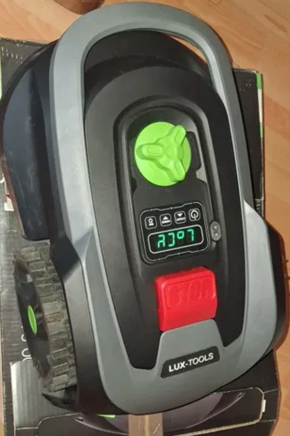

# ESPHome for SNK robot mowers (Lux Tools A-RMR-300-24 and clones)



Replacement firmware for the display board of the **SNK** OEM robot mower, which is sold under many brands. It runs [ESPHome](https://esphome.io) on the ESP32 that is already in the mower and connects the mower to Home Assistant, with no extra hardware. The mainboard keeps its original firmware, so the mower still mows on its own schedule, follows the boundary wire and returns to its station.

The repository also documents the hardware, the original firmware of all three chips and the protocol between them.

## Features

| | Feature |
|---|---|
| ✅ | Link to the mainboard: boot handshake, keepalive, resync after an OTA update without switching the mower off |
| ✅ | PIN unlock (PIN set in the configuration) |
| ✅ | Start mowing, return to the station, stop, edge trim from Home Assistant |
| ✅ | Front buttons START, HOME, OK (START/HOME, then OK, as in the original) |
| ✅ | 4-digit LED display: state, battery level, error code, flicker-free multiplexing, night dimming (20:00–06:00) |
| ✅ | Buzzer |
| ✅ | Rain sensor, reported to the mainboard (starts its rain delay) and to Home Assistant |
| ✅ | State: idle, mowing, edge trimming, returning, charging, docked, error, locked |
| ✅ | Battery level, error code, operating time, mowed area, device info |
| ✅ | OTA updates over WiFi |
| — | Red STOP button and power switch: handled by the mainboard, unchanged |

## Supported mowers

All of these share the mainboard `SNK_MAINBOARD_CP_V11` (part number `80102372-01`) and the display board `SNK_DISPLAY_CP_V11` (`80102373-01`). The component was developed and tested on a Lux Tools A-RMR-300-24.

| Brand | Model(s) | Sold at / region |
|---|---|---|
| **Lux Tools** | A-RMR-300-24, Oryx 300 Vision A-RMR-300-26 | OBI (PL/DE) |
| **Scheppach** | BRMR300, BTRM300, RRMA300 | Bauhaus, Aldi (DE/SE) |
| **Brucke** | RM500, RM501, RM800 | Finland |
| **Adano** | RM5 | Harald Nyborg, Schou (DK/SE) |
| **Gomag** | Go-MR300 | DE |
| **Grouw** | City 300² | Schou (Scandinavia) |
| **Smart** | 365 500m² | Schou (Scandinavia) |
| **Meec Tools** | 300 m² (art. 027415) | Jula (FI/SE) |
| **Julan** | 300 m² | Jula (FI/SE) |
| **Sunseeker** | V1 300m² Vision AI | Puuilo (FI) |
| **Villartec** | MI 302 | |
| **Landxcape** | (named in the firmware) | |

## Getting started

1. [Install ESPHome on the mower](docs/install.md): open the mower, back up the original firmware over the J1 header, flash, done. Later updates go over WiFi.
2. Configure it: [esphome/snk-mower.yaml](esphome/snk-mower.yaml) is a complete configuration; the options are in [docs/component.md](docs/component.md).

You need the mower's PIN. If you do not know it: [docs/pin-recovery.md](docs/pin-recovery.md).

## Documentation

| Document | Contents |
|---|---|
| [docs/install.md](docs/install.md) | Installing and updating ESPHome on the mower |
| [docs/component.md](docs/component.md) | The `snk_mower` component: options, entities, actions |
| [docs/hardware.md](docs/hardware.md) | Boards, chips, connectors, pinouts, display, rain sensor |
| [docs/disassembly.md](docs/disassembly.md) | Opening the mower |
| [docs/protocol.md](docs/protocol.md) | The display ↔ mainboard UART protocol: frames, handshake, commands, states |
| [docs/firmware-esp32.md](docs/firmware-esp32.md) | Original display firmware (ESP32): layout, functions, cloud/MQTT |
| [docs/firmware-u13.md](docs/firmware-u13.md) | Original mainboard firmware (GD32F305): layout, functions, watchdogs, settings storage |
| [docs/firmware-u16.md](docs/firmware-u16.md) | Original boundary-wire firmware (GD32F303) |
| [docs/usb.md](docs/usb.md) | USB socket: firmware update from a stick, factory reset, bootloader |
| [docs/reverse-engineering.md](docs/reverse-engineering.md) | Dumps, SWD, logic-analyser captures, tools |

Other topics: [battery pack and BMS](docs/battery.md), [PIN recovery](docs/pin-recovery.md).

## Repository layout

```
components/snk_mower/   ESPHome component
esphome/                example configuration and secrets template
docs/                   documentation, photos (docs/img), user manual and datasheets (docs/reference)
dumps/                  firmware dumps: esp32, u13 (+ Ghidra exports), u16, mi302 (second unit)
captures/               logic-analyser captures of the original firmware on J8
tools/                  capture decoders, disassemblers (tools/re), OpenOCD scripts (tools/swd)
```

## About this project

The component and most of the documentation were vibe-coded: written with AI assistance and verified on a real mower. Expect rough edges, and check claims marked as inferred before relying on them.

Documentation produced through reverse engineering for interoperability and educational purposes.

## Links

- [salonnikov/mower-stock-reverse](https://github.com/salonnikov/mower-stock-reverse): independent teardown of the same boards (VILLARTEC MI 302): U13/U16 decompilation, battery BMS link, motor drivers, SWD tooling, a custom U13 firmware. Their "chip1" is our U13, "chip2" our U16. Their dumps are in [dumps/mi302](dumps/mi302/README.md).
- [Brucke RM500/RM501/RM800 thread on io-tech.fi](https://bbs.io-tech.fi/threads/brucke-rm500-rm501-rm800-robottiruohonleikkurin-infopaketti.405186/) (Finnish): owners' experience with the same platform, USB firmware updates, PIN reset via the app.
- [Sdahl1234/Sunseeker-lawn-mower](https://github.com/Sdahl1234/Sunseeker-lawn-mower): Home Assistant integration for the Sunseeker cloud, which the original ESP32 firmware speaks ("OLD" models).
- [OlliKantola/Sunseeker_LawnMower_Control](https://github.com/OlliKantola/Sunseeker_LawnMower_Control): Sunseeker cloud MQTT command list.
- SK Robot service documents: [1](https://www.sk-robot.com/uploads/202109/18/210918101541646.pdf), [2](https://www.sk-robot.com/uploads/202109/18/210918101451197.pdf).
