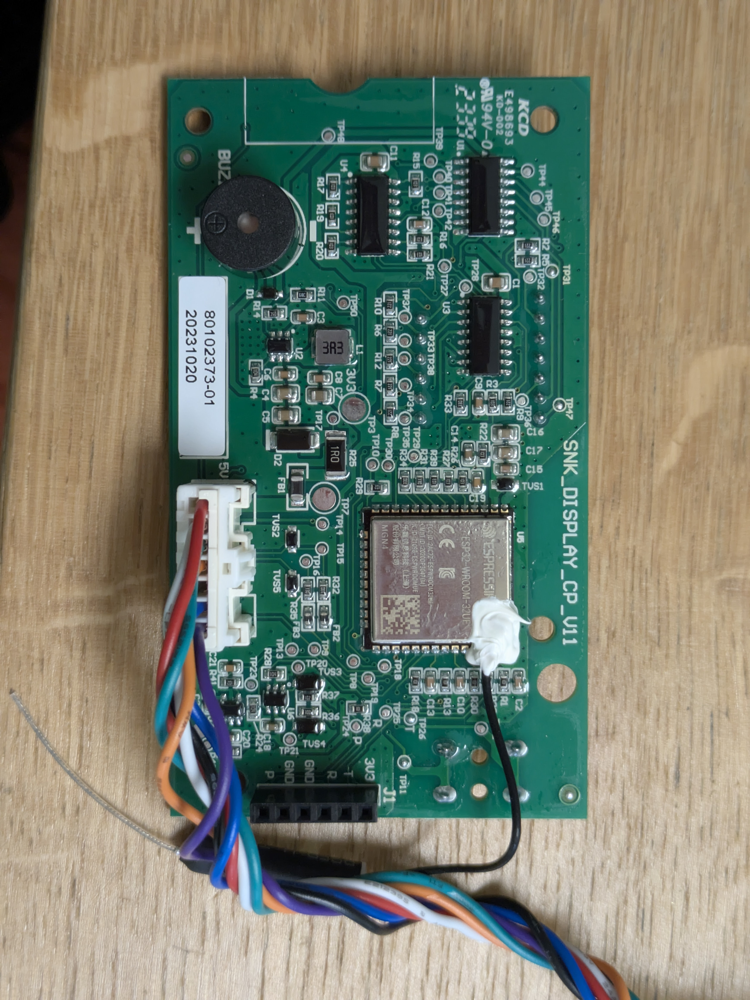
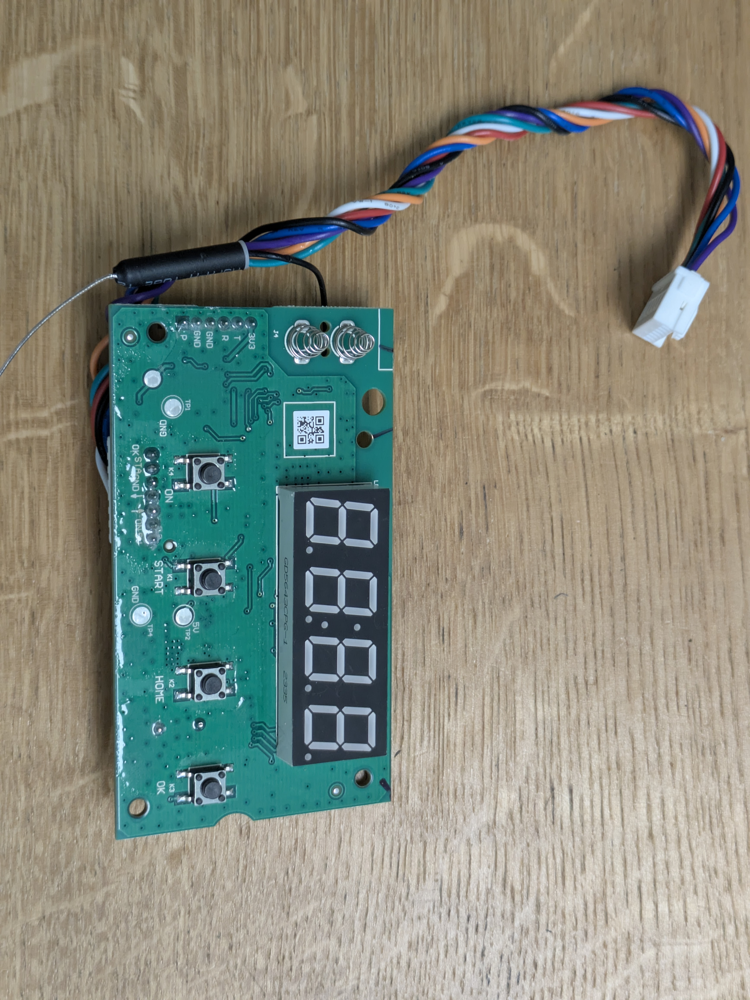

# Hardware

The mower has two PCBs joined by a 7-wire ribbon cable:

1. **Mainboard** `SNK_MAINBOARD_CP_V11` (part number `80102372-01`): motors, sensors, navigation, battery management.
2. **Display board** `SNK_DISPLAY_CP_V11` (part number `80102373-01`): ESP32, buttons, 7-segment display, buzzer, rain sensor.

Both are shared by all SNK rebrands (see the [README](../README.md#supported-mowers)). How to open the mower: [disassembly.md](disassembly.md).

```
        Display board (SNK_DISPLAY_CP_V11)
        ┌──────────────────────────────────────────┐
        │ ESP32: UI, START/HOME/OK, 4-digit LED,   │
        │ buzzer, rain sensor, WiFi/BT             │
        └────────────────────┬─────────────────────┘
                             │ J8: UART 230400 8N1, JSON &{...}<CRC8>#
        Mainboard (SNK_MAINBOARD_CP_V11)
        ┌────────────────────▼─────────────────────┐
        │ U13 (GD32F305): state machine, motors,   │
        │   navigation, PIN, USB bootloader,       │
        │   power latch (PE12)                     │
        │   ├─ USART1 (bdport) ── U16 (GD32F303):  │
        │   │    boundary-wire coils, lift sensors │
        │   ├─ USART2 19200 ───── battery BMS (J5) │
        │   ├─ SPI1 ───────────── 3× FU6832N BLDC  │
        │   │                     (left, right,    │
        │   │                      blade)          │
        │   ├─ I2C 0x68 ───────── ICM-426xx IMU    │
        │   └─ SPI ────────────── W25Q64 NOR: env  │
        │                         (PIN, settings)  │
        └──────────────────────────────────────────┘
```

---

## Mainboard: `SNK_MAINBOARD_CP_V11`

 

| Label | Value |
|---|---|
| Board | `SNK_MAINBOARD_CP_V11` |
| Part number | `80102372-01` |
| Date code | `202311074577` |
| Certifications | `KCD E498693 KD-002`, `94V-0` |

### Chips

| Ref | Part | Role |
|---|---|---|
| **U13** | GigaDevice `GD32F305AGT6` (Cortex-M4) | Main MCU: state machine, motors, navigation, PIN and settings, USB bootloader. Firmware: [firmware-u13.md](firmware-u13.md) |
| **U16** | GigaDevice `GD32F303CGT6` (Cortex-M4) | Boundary-wire receiver and lift sensors, JSON link to U13. Firmware: [firmware-u16.md](firmware-u16.md) |
| — | Winbond `W25Q64JVSIQ`, 8 MB SPI NOR | U13's EasyFlash env: PIN (`pwd`), user settings, schedule, product config, event log, firmware staging |
| — | TDK ICM-426xx IMU, I²C `0x68` | Tilt, slope and lift detection. U13 PB10 = SCL, PB11 = SDA (I2C1). The firmware accepts WHO_AM_I `0x47` (ICM-42688-P) or `0x6F`; a Bosch BNO055 driver (`0x28`) is also compiled in. The package has not been located on the photos |
| 3× | Fortior FU6832N | BLDC controllers (8051 + FOC, own firmware) for the left wheel, right wheel and blade. They emulate the Allegro A4963 SPI register interface, which is what the U13 firmware drives (`a4963_snk_v2.c`). Identified on the boards of the same platform in [salonnikov/mower-stock-reverse](https://github.com/salonnikov/mower-stock-reverse) |
| **U7** | Buck converter | 20 V battery → logic rails |
| **U22** | 8-pin, next to J7 | Not identified |

### Power control (U13 pins)

| Pin | Role |
|---|---|
| **PE12** | Main power latch. Raised first thing by the bootloader; power-off holds it low until the rail collapses |
| PE7 | Auxiliary rail, raised by the bootloader, dropped first on power-off |
| PB0 | Secondary latch, raised by the bootloader on a power-on reset |
| PE10, PE11 | Key inputs, active low ("key press power on"); most likely the `Start`/`OK` lines of J8 |
| PE8 | Charger present, active high |

### Motor drivers (U13 pins)

| Signal | Pin |
|---|---|
| SPI1 SCK / MISO / MOSI | PB13 / PB14 / PB15 |
| Common driver enable | PB12 |
| Chip select left / right / blade | PD5 / PD4 / PD3 (active low) |
| Speed PWM left / right / blade | TIMER2 full remap: PC9 (CH3) / PC8 (CH2) / PC7 (CH1) |
| Wheel speed feedback | TIMER3 input capture |

SPI word: bits 15–13 register, bit 12 write, bits 11–0 data. The init writes eight registers per driver, e.g. `03E8 22DF 4753 6721 8735 A736 C000 EE0D` (`EE0D` = run).

### Connectors

| Connector | Label | Function |
|---|---|---|
| **J8** | `+5V ON → ← GND Start OK` | Display board ribbon cable, see below |
| **J5** | `BATTERY` | 4-pin battery connector (JST VL type): V+, GND and the BMS data line ([battery.md](battery.md)) |
| `LEFT`, `RIGHT`, `BLADE` | `A B C` | Motor phases |
| `CHA` | `C- C+` | Charging contacts |
| J9 | — | Boundary-wire coils (two, under the chassis) |
| J10 / H2 | `HALL +5V GND` | Hall sensor (lift / collision) |
| U19 | `STOP` | Red STOP button, read by U13 |
| **J6** | `GND D- D+ 5V` | USB-A socket for a pendrive, used by the U13 bootloader at power-on only ([usb.md](usb.md)) |
| J7 | `+5V ↑ ↓ GND` | Populated, unused 4-pin UART header (TVS TUS5/TUS6, series resistors R169/R171). Most likely the `ledport` (UART3) connector for the optional LED/ultrasonic board; not traced to U13 pins |
| **P4** | `3V3 DIO CLK JTDO RES GND` | SWD of U13 |
| **P5** | `GND RES JTDO CLK DIO 3V3` | SWD of U16 |

#### J8 (display board ↔ mainboard)

| Pin | Label | Signal | Direction |
|---|---|---|---|
| 1 | `+5V` | Supply of the display board | MB → display |
| 2 | `ON` | Power button K4 | display → MB (U13 only) |
| 3 | `→` | UART, U13 USART0 TX → ESP32 GPIO16 | MB → display |
| 4 | `←` | UART, ESP32 GPIO17 → U13 USART0 RX | display → MB |
| 5 | `GND` | Ground | |
| 6 | `Start` | Button K1 (also read by the ESP32 on GPIO22) | display → MB |
| 7 | `OK` | Button K3 (also read by the ESP32 on GPIO19) | display → MB |

The UART is the only data link between the boards. The protocol is in [protocol.md](protocol.md).

#### SWD

P4 (U13) is a row of through-hole pads on the right edge next to the USB socket, P5 (U16) a black socket on the left. The labels are on the back of the board.

| P4 pin | Label | TP | | P5 pin | Label |
|---|---|---|---|---|---|
| 1 | `3V3` | TP74 | | 1 | `GND` (TP58) |
| 2 | `DIO` | TP76 | | 2 | `RES` (TP57) |
| 3 | `CLK` | TP77 | | 3 | `JTDO` (TP55) |
| 4 | `JTDO` | TP78 | | 4 | `CLK` (TP56) |
| 5 | `RES` | TP80 | | 5 | `DIO` (TP64) |
| 6 | `GND` | TP81 | | 6 | `3V3` |

A Raspberry Pi Pico with [debugprobe](https://github.com/raspberrypi/debugprobe) works as the adapter: GP2 = SWCLK, GP3 = SWDIO, plus GND. **Do not connect 3.3 V**: the mower powers the MCU from its battery. Dumping is described in [reverse-engineering.md](reverse-engineering.md#swd).

---

## Display board: `SNK_DISPLAY_CP_V11`

 

| Label | Value |
|---|---|
| Board | `SNK_DISPLAY_CP_V11` |
| Part number | `80102373-01` |
| Date code | `20231020` |

### Parts

| Ref | Part | Role |
|---|---|---|
| **U5** | Espressif `ESP32-WROOM-32UE` (4 MB flash, dual core, WiFi b/g/n, Bluetooth 4.2 BR/EDR + BLE) | Everything on this board. External antenna on the U.FL connector (wire monopole). FCC ID `2AC7Z-ESPWROOM32UE` |
| Display | `GD5643CPG-1` | 4-digit 7-segment LED with colon |
| **U1, U3, U4** | `74HC595` | Cascaded shift registers driving the display |
| **U2** | Buck converter | 3.3 V from the +5 V of J8 |
| **BU1** | Buzzer | Driven by a transistor from GPIO27 |
| K1–K4 | Buttons | START, HOME, OK, ON |
| J3, J4 | Spring contacts | Rain sensor electrodes, pressed against a contact plate in the housing |

### ESP32 GPIO

| GPIO | Module pad | Function | Notes |
|---|---|---|---|
| 16 | 27 | UART RX from U13 | via FB3, R35, TVS5 |
| 17 | 28 | UART TX to U13 | via FB2, R32, TVS2 |
| 22 | 36 | K1 START | input, internal pull-up, active low |
| 21 | 33 | K2 HOME | input, internal pull-up, active low; not on J8 |
| 19 | 31 | K3 OK | input, internal pull-up, active low |
| 33 | 9 | Display SCLK | 74HC595 `SH_CP` (pin 11) of U1/U3/U4, via R33 |
| 25 | 10 | Display data | 74HC595 `DS` (pin 14) of U1, via R34/TP29 |
| 32 | 8 | Display latch | 74HC595 `ST_CP` (pin 12) of U1/U3/U4, via R31/TP27 |
| 27 | 12 | Buzzer | via R29 to the transistor driver |
| 36 | 4 | Rain sensor input | ADC1_CH0 (SENSOR_VP), 11 dB attenuation |
| 18, 5 | | Rain sensor electrode drive | outputs, alternating polarity |
| 26 | | Unknown | the original firmware sets it high at display init and low after the first blank frame |
| 2 | | Unknown | the original firmware drives it high for 15 s after boot and after each OK press |
| 1, 3 | | UART0 on J1 | programming only |

K4 (ON) is not wired to the ESP32; it only goes to J8. Full pin list of the module: [reference/esp32-wroom-32-pins.md](reference/esp32-wroom-32-pins.md).

### Display

The three 74HC595 form a 24-bit shift register. `OE` (pin 13) is tied to GND and `MR` (pin 10) pulled up to 3.3 V, so the outputs are always on and brightness cannot be changed in hardware. A frame is one digit:

| Bits (24-bit word, MSB first) | Function |
|---|---|
| 23–16 | Not used (0) |
| 13 / 12 / 11 / 10 | Select digit 1 / 2 / 3 / 4 |
| 8 | Colon |
| 7–0 | Segments a–g, dp |

The original firmware shows each digit for 2 ms (one frame every 8 ms, 125 Hz) from a top-priority task on core 1, and blinks the colon from a 700 ms timer. The ESPHome component does the same from a hardware timer; its night mode dims the display by blanking each digit before the end of its 2 ms slot.

The board photos with the traces are [img/display_front2.jpg](img/display_front2.jpg).

### Rain sensor

Resistive, between the J3/J4 electrodes. Every 2 s GPIO18 is driven high and GPIO5 low for 1 s, five ADC samples are taken on GPIO36 at the end of that phase, then the polarity is reversed for 1 s so the electrodes do not corrode. A running average above 3000 (of 4095) is dry; 16 readings in a row on one side change the state. The ESP32 reports it to U13 as `0x22000000 {"rain":1}` (dry) or `{"rain":2}` (raining).

### J1: programming header

| Pin | Label | Signal |
|---|---|---|
| 1 | `3U3` | 3.3 V |
| 2 | `T` | ESP32 TX (GPIO1, UART0) |
| 3 | `R` | ESP32 RX (GPIO3, UART0) |
| 4 | `GND` | Ground |
| 5 | `GND` | Ground |
| 6 | `P` | GPIO0 (boot mode: low at reset = download mode) |

J1 is not connected to the mainboard. It is how the ESPHome firmware is flashed the first time ([install.md](install.md)).
